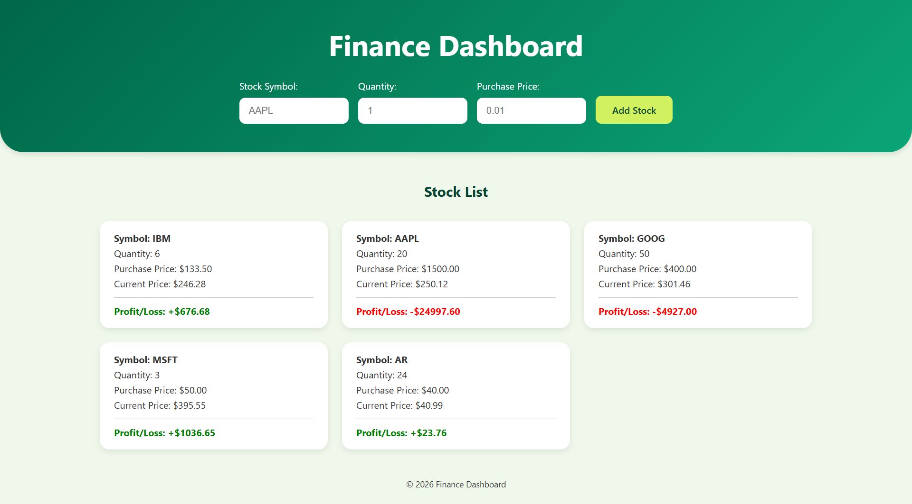

# 💹 Finance Dashboard

A React-based Finance Dashboard that allows users to track stocks they have purchased. Users can add stocks with quantity and purchase price, fetch the latest stock market prices using the `Alpha Vantage API`, and view real-time profit or loss for each stock.

## 🖼️ Preview
🔗 Live Demo: https://rushdina.github.io/finance-dashboard/



## 🛠️ Technologies Used
- **Frontend:** `React`, `JavaScript`, `CSS`
- **State Management:** `Context API` – Centralized global stock state and shared logic between components
- React Hooks:
  - `useState`: Manages form inputs and stock list state
  - `useEffect`: Handles conditional fetching of stock prices
  - `useContext`: Accesses shared state and functions from `StockContext`
  - `useCallback`: Memoizes API fetch function to avoid unnecessary recreations
- **External APIs:** [Alpha Vantage API](https://www.alphavantage.co/documentation/) – Provides real-time stock market data
- **npm Packages:** `nanoid` – Generates unique IDs for stable React keys

## ✨ Features
- Add stocks with symbol, quantity, and purchase price
- Validate symbols using `Alpha Vantage API`
- Fetch and display current stock prices
- Compute and display color-coded profit/loss
- Automatically merge duplicate stocks and recalculate average purchase price
- Handle API rate limit, network errors, and invalid symbols
- Display loading states while fetching prices
- Responsive UI using `Flexbox` and `CSS Grid`

## 💻 Installation & Running Locally
1. **Clone the repository**

```bash
git clone https://github.com/<username>/<repository>.git
cd <repository>
```

2. **Install dependencies**

```bash
npm install
```

3. **Set up environment variables**
- Create a `.env` file in the root folder and add your `Alpha Vantage API` key:

```bash
VITE_ALPHA_KEY=your_alpha_vantage_api_key
```

You can obtain a free API key from: https://www.alphavantage.co/support/#api-key

4. **Run development server**

```bash
npm run dev
```

Open the localhost URL shown in your terminal (usually `http://localhost:5173`).

## 🚀 Usage
1. Enter a **stock symbol**, **quantity**, and **purchase price**.
2. Click **Add Stock**.
3. The stock appears in the list with:
  - Current market price (fetched from API)
  - Calculated profit/Loss (color-coded)
Additional behaviour:
- Duplicate symbols automatically merge and recalculate average purchase price.
- Invalid stock symbols show inline validation errors.
- API rate limit or network errors display system-level messages below the form.

## 🧠 Challenges Encountered
- **API Rate Limits**: Alpha Vantage free-tierlimits requests (25 per day and 1 per second).
  - Solution: Implemented error handling for rate limit responses and displayed user-friendly error messages when the limit is reached.
- **Duplicate API Calls**: Both `StockForm` and `StockList` could trigger API requests.
  - Solution: Centralized the API fetch function in `App.jsx` and shared it through `Context API` so components reuse the same logic.
- **Invalid Stock Symbols**: Users could attempt to add invalid stock symbols.
  - Solution: Used optional chaining (`?.`) and `parseFloat()` validation to detect invalid API responses and display inline errors.
- **Duplicate Stocks**: Users might add the same stock multiple times.
  - Solution: Used `.find()` to detect existing stocks and `.map()` to merge quantities while recalculating the average purchase price.
- **Preventing Unnecessary API Calls**: State updates could trigger repeated fetch requests.
  - Solution: Added **guard conditions** to only fetch prices when currentPrice is null.
- **Testing Application Logic**: Testing logic involving context and API calls was challenging.
  - Solution: Created mock `Context` providers and isolated logic functions to test behaviour independently.

## ✨ Improvements Beyond Baseline Requirements
- **Enhanced User Experience**:
  - Inline validation for invalid stock symbols
  - Separate error messages for input errors vs API errors
  - Loading indicators when fetching stock prices
  - Responsive interface for different screen sizes
- **Improved State Logic**:
  - Automatically merges duplicate stocks
  - Recalculates average purchase price dynamically
  - Uses nanoid to generate stable React keys
- **Performance Considerations**
  - Memoized API functions with `useCallback`
  - Conditional state updates to avoid unnecessary re-renders
 
## 📚 What I Learned
- React state management using `Context API` and Hooks
- API integration and asynchronous data handling
- Error handling for API limits, network issues, and invalid inputs
- Immutable state updates for merging and updating stock data
- Unit testing with `Vitest` and `React Testing Library`
 
## 💡 Future Improvements
- Manual refresh button to update stock prices
- Persistent storage using localStorage or a backend database
- Stock price history visualization
- Portfolio summary statistics (total investment, total profit/loss)
- API request caching to reduce rate limit issues
